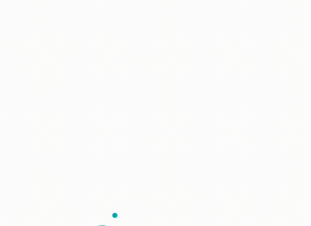

# Custom Cursor Component
An interactive React component that replaces the default cursor with a custom, animated cursor. Designed for a modern user experience, this component includes a small cursor dot that follows the mouse and a larger trailing cursor with smooth animations.

## Features

- **Smooth Cursor Animation**: A small cursor follows the mouse closely, while a larger cursor follows with a trailing effect.
- **Customizable Styles**: Easily adjust colors, sizes, and animation speed using `styled-components`.
- **Minimal Setup**: Drop the component into any React project, and it’s ready to go.
## 🎥 Demo



## Installation

1. **Clone the Repository**:
   ```bash
   git clone https://github.com/nouhaila-elh/custom-cursor.git
   cd custom-cursor

2. **Install Dependencies**:
   ```bash
   npm install

3. **Start the App**:
   ```bash
   npm start
